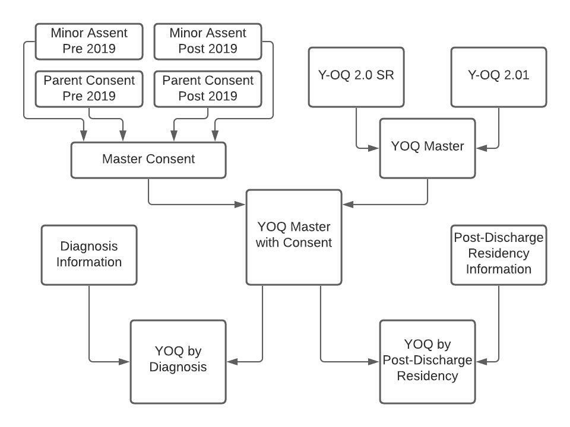
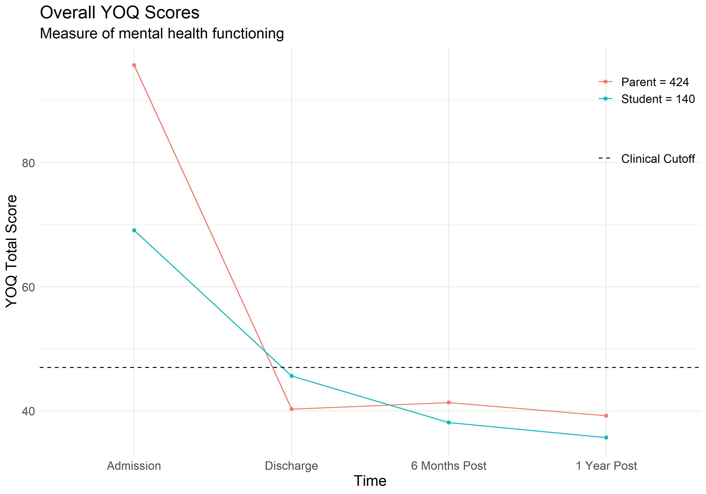
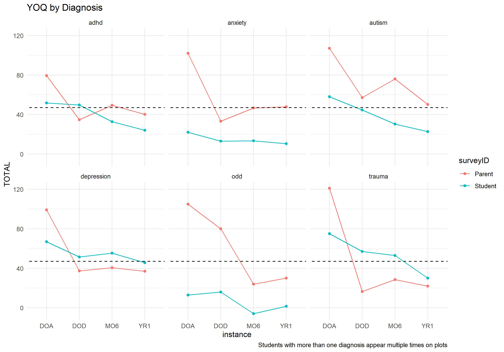
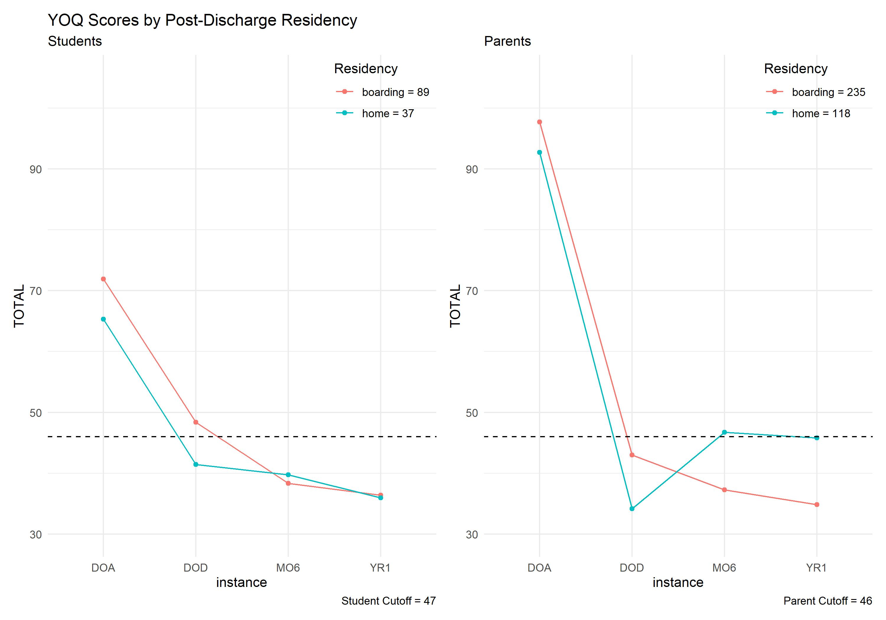

```{r setup, include=FALSE}
knitr::opts_chunk$set(echo = FALSE)
knitr::opts_knit$set(root.dir = here::here())


library(tidyverse)
library(rstatix) # pipe-friendly R functions for easy statistical analysis
library(patchwork)
library(knitr) # kable() makes tables nice
```


The most common and obvious question any parent has when seeking a new form of therapy for their child is, “Will this program help?”  This question is especially important to answer before sending a child to a less common form of therapy such as Outdoor Behavioral Healthcare (OBH).  OBH is described as the prescriptive use of wilderness experiences by licensed mental health professionals to meet the therapeutic needs of clients.  

The OBH program I worked with operates on a backcountry model where trained field guides lead adolescents struggling with substance abuse, technology overuse, family issues, etc. on extended backpacking trips.  In the setting of the wilderness, clients work through the therapeutic program by facing individual challenges, accomplishing tasks as a group, and learning outdoor skills.  The implementation of therapeutic treatment plans is woven into all daily activities.  

The program administers the Youth Outcomes Questionnaire (YOQ), a measure of mental health functioning, at intake, discharge, six months post-discharge and one year post-discharge.  Although the program has been issuing the YOQ since their founding in 2013, they lacked the necessary skills to aggregate, clean, and visualize the data.  

I teamed up with the program's Clinical Director to provide the data analysis skills necessary to help parents answer the question, “Will this program help my child?”  

## 1. Objective  

* To present a clean and accessible visualization of overall patterns of improvement in mental health functioning of clients as a result of attending the OBH program.  
* Drill into the overall patterns by breaking scores out based on the questionnaire subscales, client diagnoses and the post-treatment placement of indvidiuals.  

## 2. Data Description  

Data for this project had to be aggregated and cleaned from several different sources:  

* **Y-OQ SR** (YOQ Self Report completed by adolescents)  
* **Y-OQ 2.01** (YOQ completed by parents/guardians)  
* **Data use consent** held in 4 different data sets  
* **Diagnosis data** extracted from client discharge summaries  
* **Post-discharge residency** status from demographic surveys collected from both parents and adolescents  

## 3. Data Preparation  

* In order to perform analysis, both YOQ files had to be cleaned and merged (see **YOQ clean from original data_PUBLIC.R**).  
* The consent files had to be merged together and joined to the overall YOQ dataset and the non-consenting cases removed (see **consent clean_PUBLIC.R**).  
* Due to the limited number of complete cases with data at each of the four timepoints, missing cases were predicted using imputation via linear regression for cases that had data available for both intake and discharge as well as either six months or one year post-discharge (see **YOQ imputation_PUBLIC.R**).  
* Diagnosis data had to be gathered and joined (see **diagnosis_PUBLIC.R**).  
* Finally, post-treatment status information had to be aggregated from adolescent and parent surveys and joined to the overall dataset (see **YOQ by Subscale and Diagnosis_PUBLIC.RMD**).  

Below is a data model of the steps taken to complete this project:



## 4. Results  




<br>  
<br>  



<br>  


For the script containing detailed analysis, visit YOQ project_PUBLIC.R.


